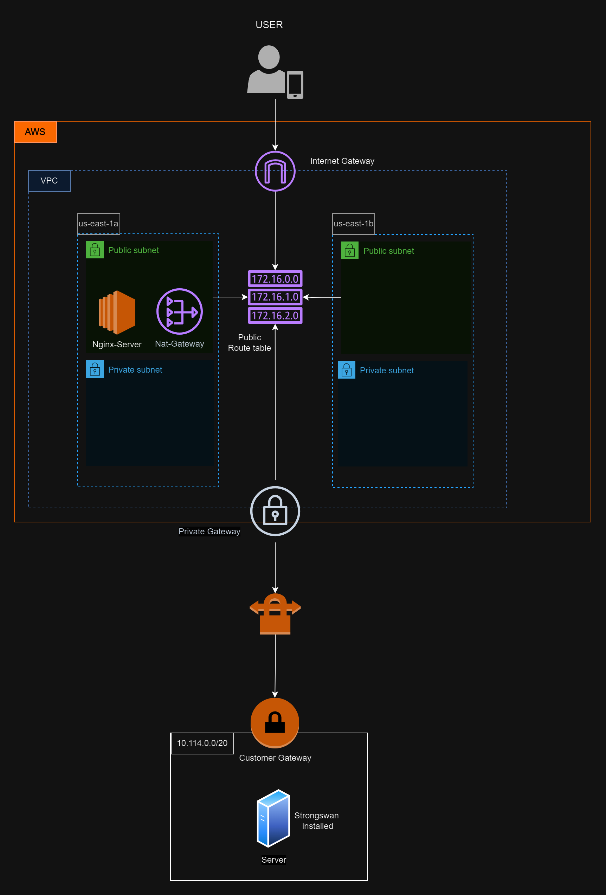

# Project Overview

{ width=100% }


This Terraform project is designed to create a secure and scalable Virtual Private Cloud (VPC) architecture on AWS, complete with a VPN connection to an on-premises network. The project is modular, allowing for flexibility in the deployment of various AWS resources such as VPCs, subnets, security groups, customer gateways, VPN gateways, and more. The infrastructure is fully automated, ensuring consistency and reliability.

## Folder Structure

- **backend.tf**: Defines the backend configuration for Terraform state management using an S3 bucket.
- **ipsec.secrets.tpl**: Template file for IPsec secrets configuration to be used in the VPN connection.
- **main.tf**: The primary Terraform configuration file that includes the main infrastructure components.
- **outputs.tf**: Outputs various resources and information created by the Terraform configuration.
- **strongswan_config.tpl**: Template file for StrongSwan VPN configuration.
- **variables.tf**: Defines variables used throughout the project, including defaults for easy customization.

<p align="left">
  
</p>


### Modules

- **customer_gateway/**:
  - **main.tf**: Creates a Customer Gateway resource on AWS, representing the on-premises VPN appliance.
  - **output.tf**: Outputs the Customer Gateway ID.
  - **variables.tf**: Defines the variables required for the Customer Gateway module.

- **security_group/**:
  - **main.tf**: Defines security groups for the VPC, including ingress and egress rules.
  - **output.tf**: Outputs the Security Group ID.
  - **variables.tf**: Contains variables for security group configuration.

- **virtual_gateway/**:
  - **main.tf**: Creates a Virtual Private Gateway (VGW) and associates it with the VPC.
  - **output.tf**: Outputs the VPN Gateway ID.
  - **variables.tf**: Variables related to the VPN Gateway and its configuration.

- **vpc/**:
  - **main.tf**: Defines the VPC, subnets (both public and private), route tables, and associated resources.
  - **outputs.tf**: Outputs various IDs and information about the created VPC and subnets.
  - **variables.tf**: Defines the variables required for the VPC configuration.

- **vpn_connection/**:
  - **main.tf**: Establishes a VPN connection between the on-premises network and the AWS VPC.
  - **output.tf**: Outputs VPN connection details, such as tunnel IPs.
  - **variables.tf**: Contains variables needed for the VPN connection, including Customer Gateway ID, VPN Gateway ID, and on-premises CIDR.

## Getting Started

### Prerequisites

Before you begin, ensure that you have the following installed:

- **Terraform**: This project requires Terraform v0.13 or later.
- **AWS CLI**: To interact with AWS services.
- **AWS Account**: Ensure you have an AWS account with appropriate permissions.

### Configuration

1. **Backend Configuration**:  
   The project uses an S3 bucket for storing the Terraform state file and DynamoDB for state locking. Ensure that the specified bucket and DynamoDB table exist, or adjust the `backend.tf` file accordingly.

   ```hcl
   terraform {
     backend "s3" {
       bucket         = "karamtask1statefile"
       key            = "terraform.tfstate2"
       region         = "us-east-1"
       dynamodb_table = "terraform_lock"
       encrypt        = true
     }
   }
# Variables Configuration

Customize the `variables.tf` file in the root directory and within each module to match your environment's needs. Default values are provided for most variables, but you may need to adjust values such as IP ranges, instance types, and resource names.

Example:

```hcl
variable "vpc_cidr_block" {
  type    = string
  default = "10.0.0.0/16"
}
```

# IPsec and StrongSwan Configuration

The project includes template files for configuring IPsec secrets and StrongSwan. These files should be saved to your on-premises VPN device or server.

- **ipsec.secrets.tpl**: Save this file as `/etc/ipsec.secrets`.
- **strongswan_config.tpl**: Save this file as `/etc/ipsec.conf`.

Update the placeholder values in these templates with the actual IPs and pre-shared keys generated during the Terraform deployment.

# Deployment

## Initialize Terraform

Navigate to the root directory and run the following command to initialize Terraform:

```bash
terraform init
```

## Plan the Deployment

To see what resources Terraform will create, run:

```bash
terraform plan
```

## Apply the Configuration

Apply the Terraform configuration to create the resources:

```bash
terraform apply
```

Confirm the apply action when prompted.

## Output Values

After the deployment, Terraform will output several important values such as VPC ID, Security Group ID, VPN Gateway ID, etc. These can be used for further configurations or in subsequent Terraform runs.

## VPN Configuration

After deploying the infrastructure, you will need to configure the on-premises VPN appliance to establish the VPN connection. The necessary configuration files (`ipsec.secrets` and `strongswan_config.tpl`) are generated as part of the Terraform outputs.

### Configure IPsec Secrets

The `ipsec.secrets` file contains the pre-shared keys for the VPN tunnels. This file should be saved as `/etc/ipsec.secrets` on your VPN device.

### Configure StrongSwan

The `strongswan_config.tpl` file provides the configuration for the StrongSwan VPN client. Save this file as `/etc/ipsec.conf` on your VPN device.

### Start the VPN

After configuring the VPN appliance, start the VPN connection using the appropriate commands for your device.

## On-Premises Server Configuration

To set up the on-premises server (or any Linux server) to work with the VPN, follow these steps:

### Update the Server

```bash
sudo apt update
# Install StrongSwan
sudo apt install strongswan

# Enable IP Forwarding
# Open the sysctl configuration file:

sudo nano /etc/sysctl.conf

# Add the following lines:
net.ipv4.ip_forward = 1
net.ipv4.conf.all.accept_redirects = 0
net.ipv4.conf.all.send_redirects = 0

# Save and exit, then refresh the configuration:
sudo sysctl -p

# Configure IPsec
# Open the IPsec configuration file:
sudo nano /etc/ipsec.conf

# Paste the configuration from the strongswan_config.tpl file (or refer to the output file for details).
# Save and exit.

# Set IPsec Secrets
# Open the IPsec secrets file:
sudo nano /etc/ipsec.secrets

# Paste the contents from the ipsec.secrets.tpl file (or refer to the output file for details).
# Save and exit.

# Restart IPsec
sudo ipsec restart

# Check the VPN Status
# Verify that the VPN connection is established:
sudo ipsec statusall
```
